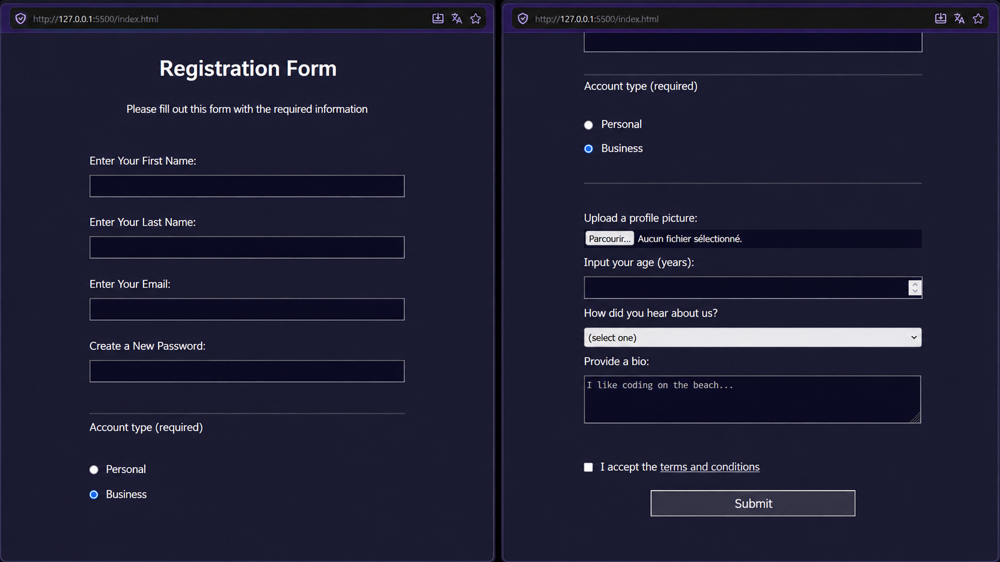

# Registration Form

Formulaire d'inscription responsive créé avec HTML5 et CSS3 dans le cadre du cours freeCodeCamp Responsive Web Design.

---

---

## Technologies

---

## Description

Formulaire multi-sections avec champs texte, boutons radio, menu déroulant, zone de texte et upload de fichier — le tout stylisé sur fond sombre avec une mise en page centrée et responsive.

---

## Ce que j'ai appris

- **Sémantique des formulaires** : utilisation de `<fieldset>` et `<legend>` pour regrouper les champs liés et améliorer l'accessibilité
- **Sélecteurs CSS avancés** : ciblage précis avec `input[type="submit"]`, `input[type="file"]`, `fieldset:last-of-type`
- **Propriété `appearance: none`** : comment et quand la supprimer pour homogénéiser le rendu des cases à cocher et des selects entre navigateurs
- **Gestion des inputs spéciaux** : comportements natifs des champs `file`, `number` et `password`, et les limites du CSS sur ces éléments
- **Mises en page fluides** : combinaison de `width`, `max-width` et `min-width` pour un formulaire responsive sans media queries

---

## Aperçu

---

## Démo en ligne

[Voir le projet sur GitHub Pages](https://docaridr.github.io/Registration-Form-freecodecamp/)

---

## Auteur

**DocariDR** — projet d'entraînement, parcours Responsive Web Design.